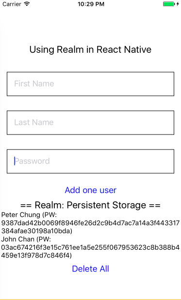

# TryRealmReactNative

An experimentation of Realm in React Native



## Installation

```sh
npm install
react-native link
react-native run-ios
```

## Realm schema
Defined in [realm.js](./realm.js)
```javascript
class User extends Realm.Object {}
User.schema = {
  name: 'User',
  properties: {
    firstName: 'string',
    lastName: 'string',
    password: 'string'
  }
};
```

